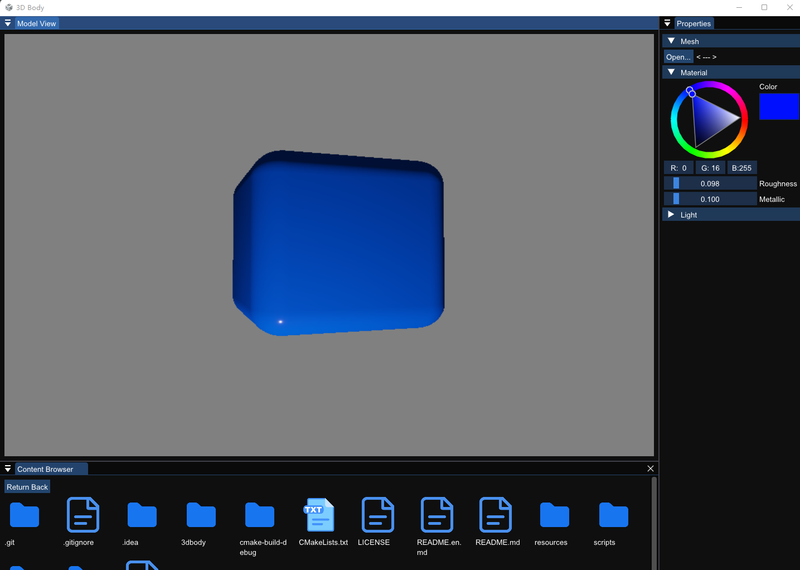
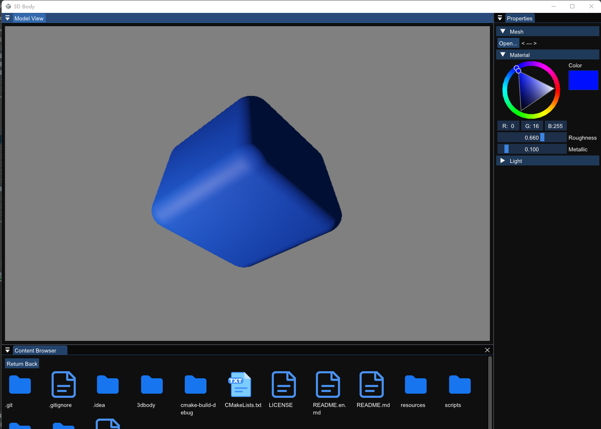

# 3dbody

## Brief Introduction.

This project is a cross-platform 3d rendering engine, currently in-progress. The features include:

+ Importing 3d model
+ Exporting 3d model
+ Model PBR visualization, corking on camera system now...
+ Model editing
+ Rigid body simulation
+ Fluid simulation
+ Deformation analysis
+ Collision analysis
+ 3d Reconstruction by SLAM
+ PBR rendering
+ Custom rendering
+ Material editing
+ Lighting, including spot-light, flash-light,etc.
+ ###Shape analysis using spectral methods.
+ Other functionalities

This project starts on 2021-11-20, currently developing by Guangfu Wang. Others interested are warmly welcomed.

## Architecture

See mdj file, in case you do not know how to use it, you can use StarUML.

## Installation

For developers, you can:

1. Download source code from gitee ot github.
2. Compiling it with cmake building tool.
3. Installing to whatever path you like.

For normal users, we will offer cross-platform installers, will coming soon...

## Snapshots
1.low roughness setting：

2.High roughness：

## LICENSE

This project uses BSD-2 LICENSE and will embrace open-source until my last breath.

## Changelog.

+ 2021-11-20：first create this project.

## Contact me

If you have any questions or suggestions, email me at: thuwgf@gmail.com

